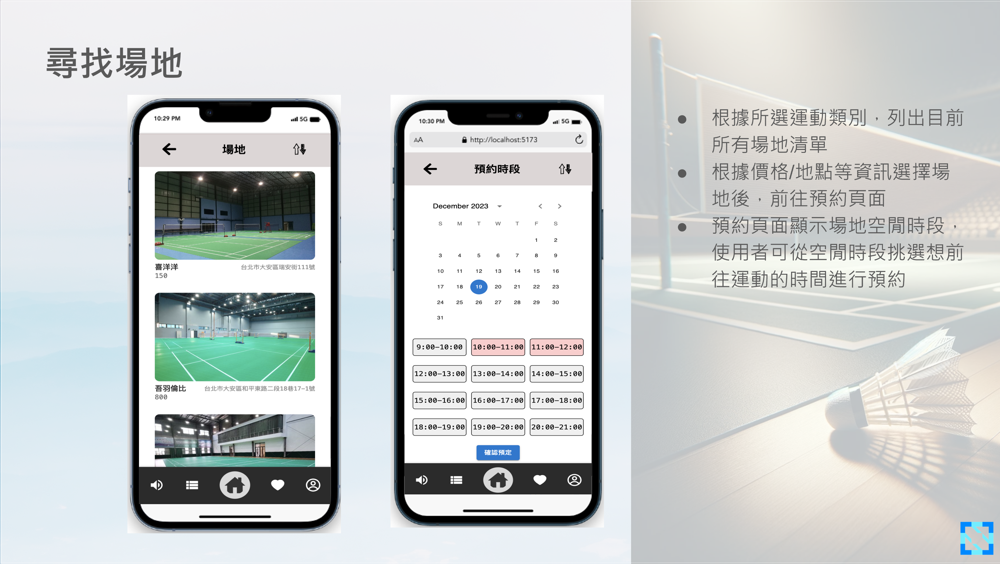
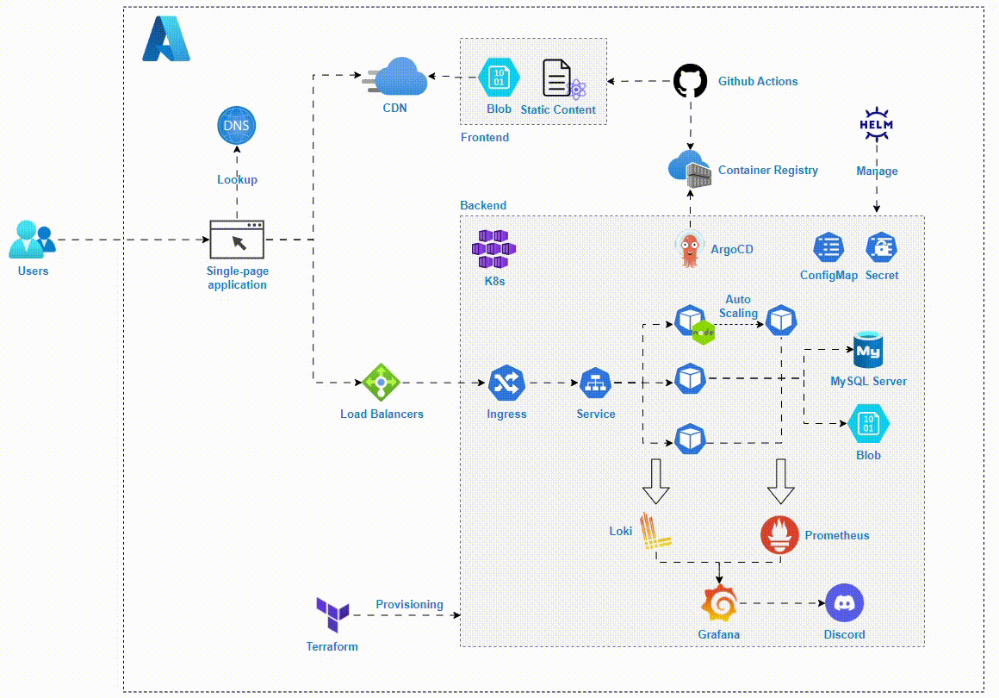
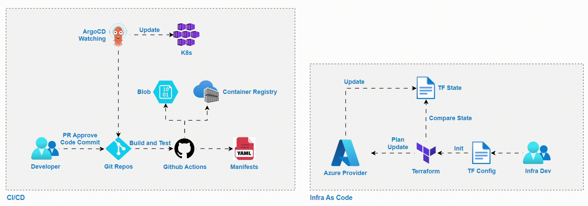
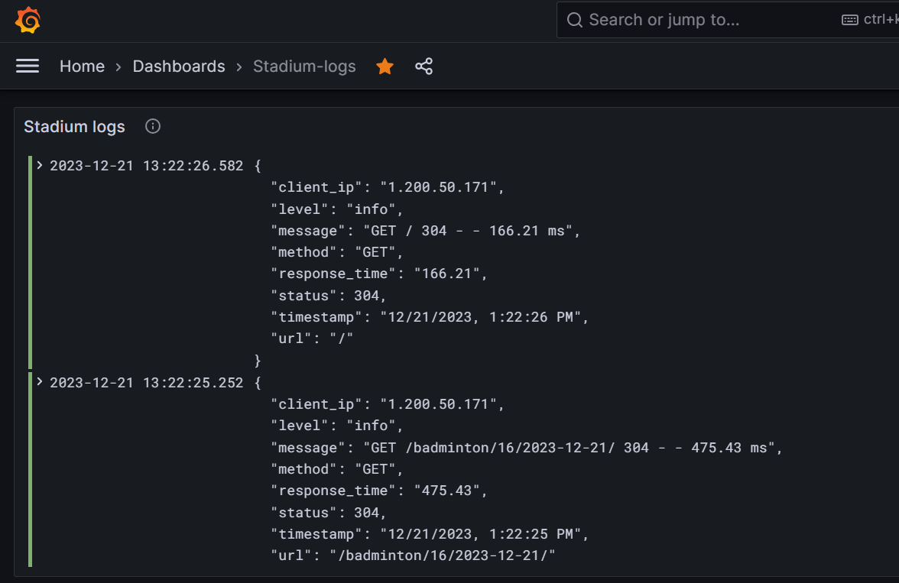
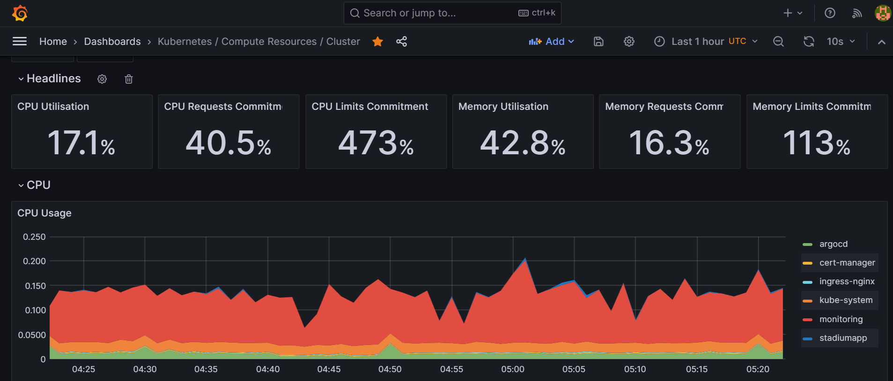
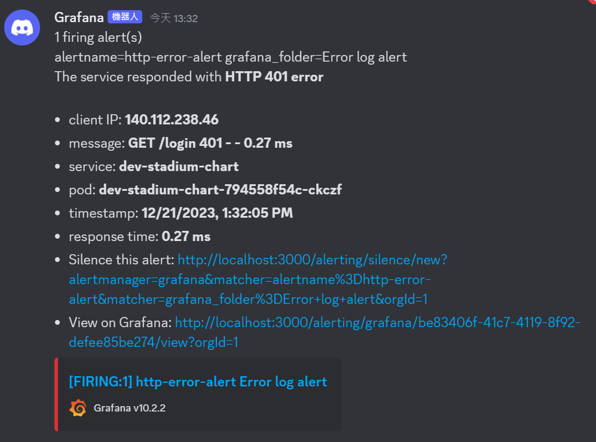

# Stadium-Matching-System
The [application](https://stadium.rdto.io/) is developed by React.js and Node.js.
## Introduction
The system allows users to select a stadium and join the activity based on the user's location and the stadium's capacity. It also provides the admin page to manage the stadium and the activity.

See [Details](./media/Group%2012_Stadium%20matching%20System.pdf) for more information.

## Deployment
### System Architecture
The frontend service is deployed on Azure Blob Storage and uses CDN to route the URL traffic to the Single Page Application. 

The backend service is deployed on Azure Kubernetes Service. It uses Nginx Ingress Controller as a Load Balancer and reverse proxy to handle SSL termination. And bind the ports to expose the services in K8s. The application is deployed by Helm.

### Devops Flow
We use GitOps to automate the infrasturcture. The CI/CD pipeline is built by Github Actions and ArgoCD. The Github Actions is triggered by the repo and uploads the static files to Blob Storage and pushes the image to Azure Container Registry. Then, the ArgoCD detects the change of the repo and deploys the application to AKS. 

The infrastructure under the application is built by Terraform. The Terraform then manages our infrastructure on Azure.

### Monitoring
The application is monitored by Loki and Grafana and the alert is sent to Discord channel when the application goes wrong.

#### Logs

#### Metrics

#### Alerts
