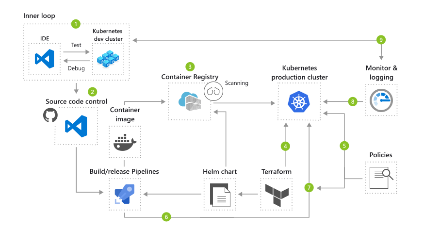

# DevOps
YAML, shell scripts or some other configs to maintain our DevOps pipeline will be places here.
We are aiming to use Azure as our cloud provider.

## CI/CD

## Monitoring

## References
### AKS

- [AKS creation in portal](https://www.youtube.com/watch?v=46xHCXbI9So)
- [Deploy image from ACR to AKS](https://learn.microsoft.com/en-us/azure/aks/cluster-container-registry-integration?tabs=azure-cli)
- [在 Azure Kubernetes Service 上部署容器化的應用程式](https://learn.microsoft.com/zh-tw/training/modules/aks-deploy-container-app/)
